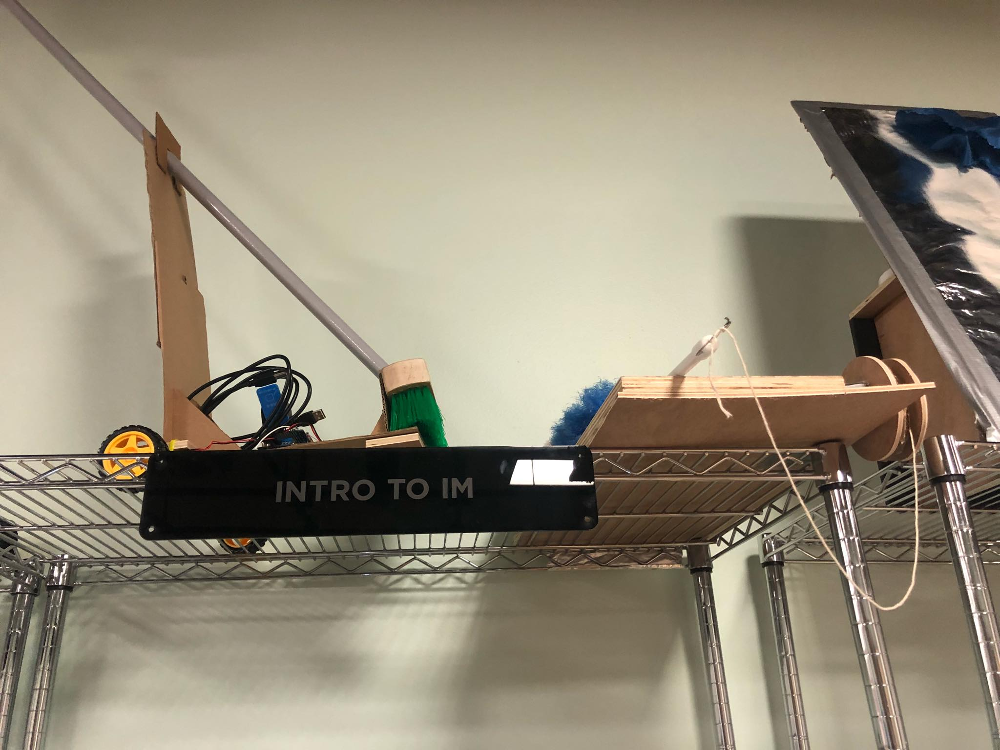
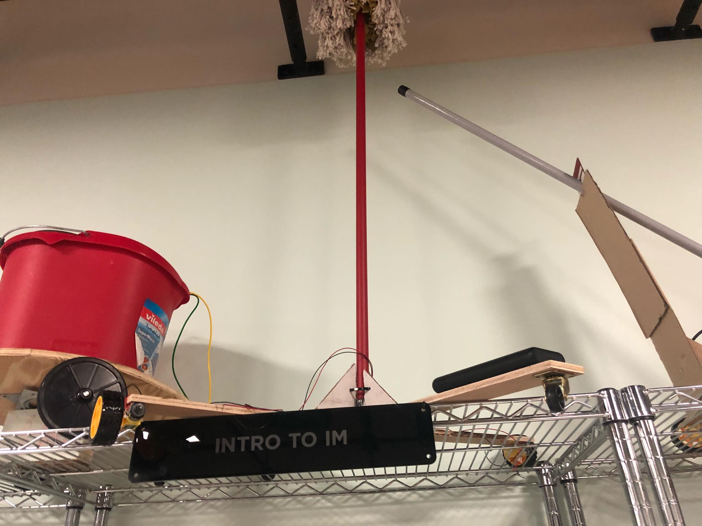
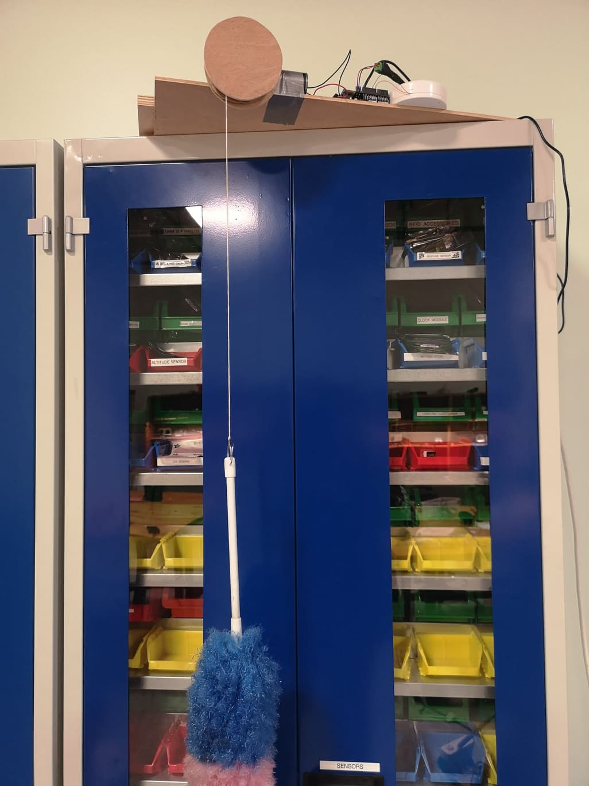
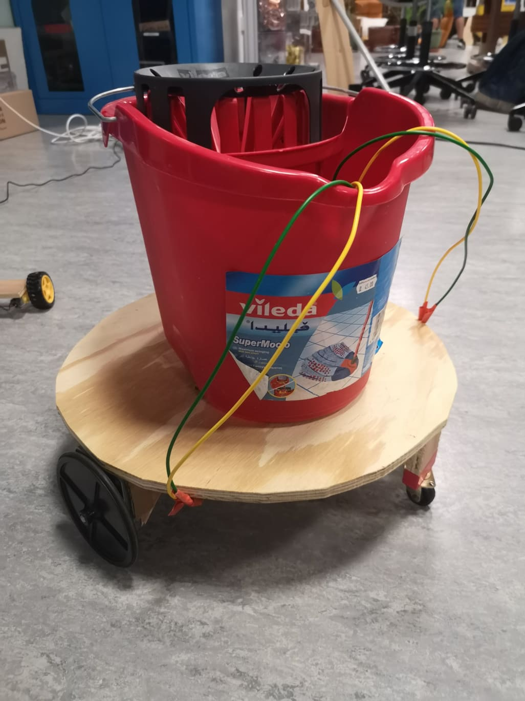
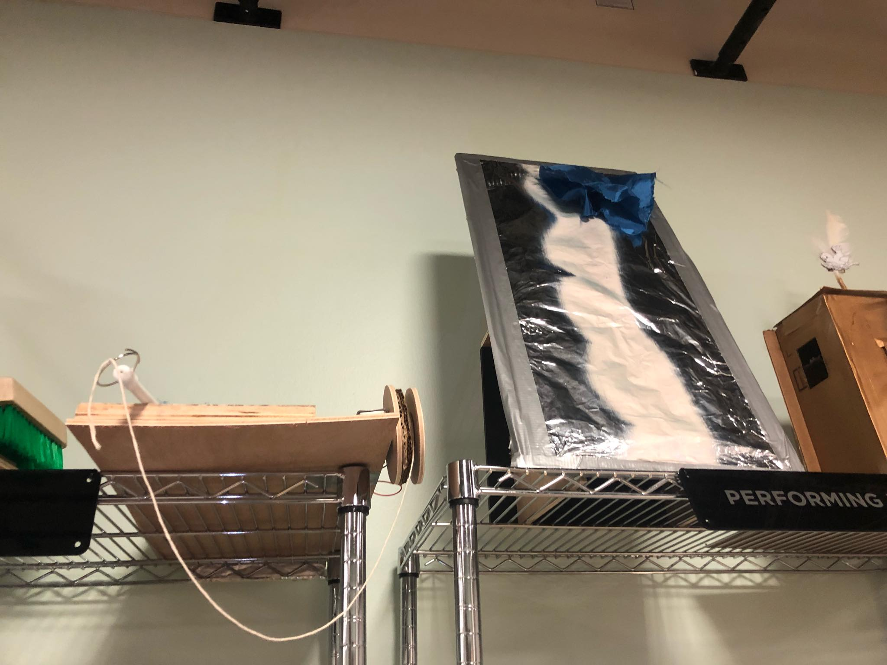
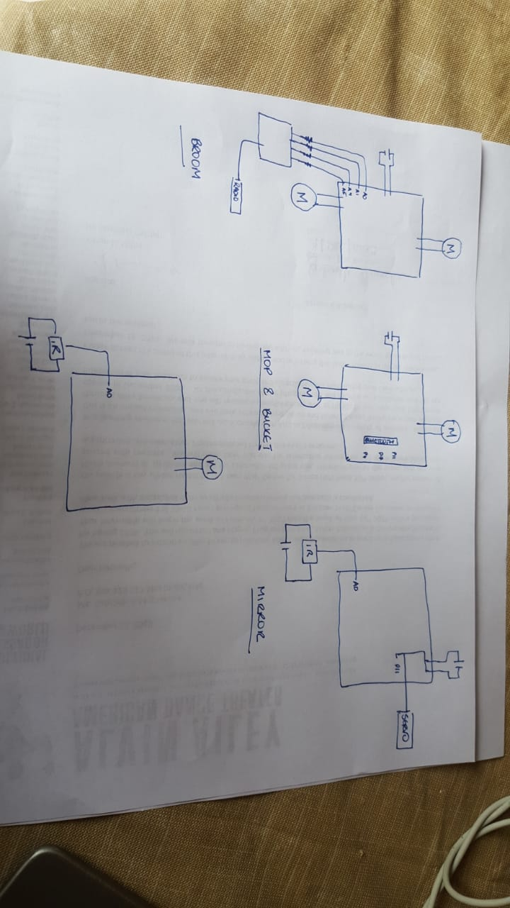
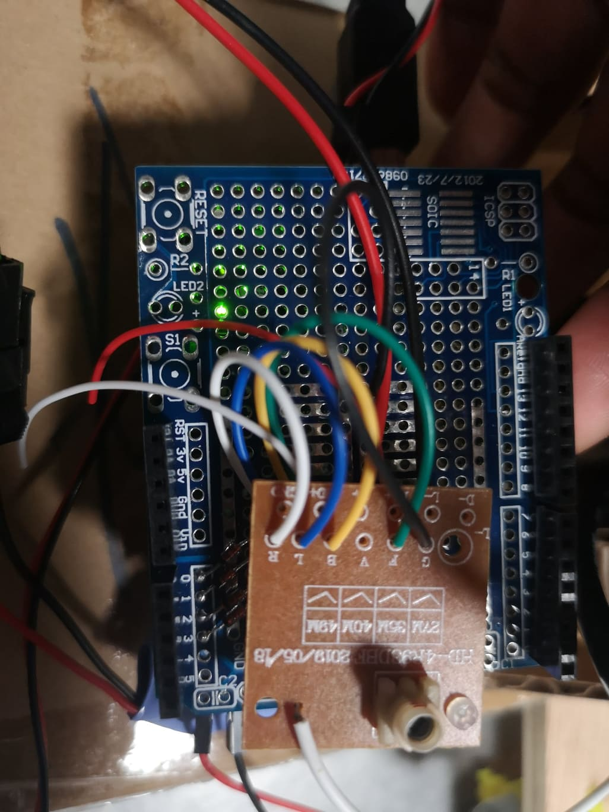
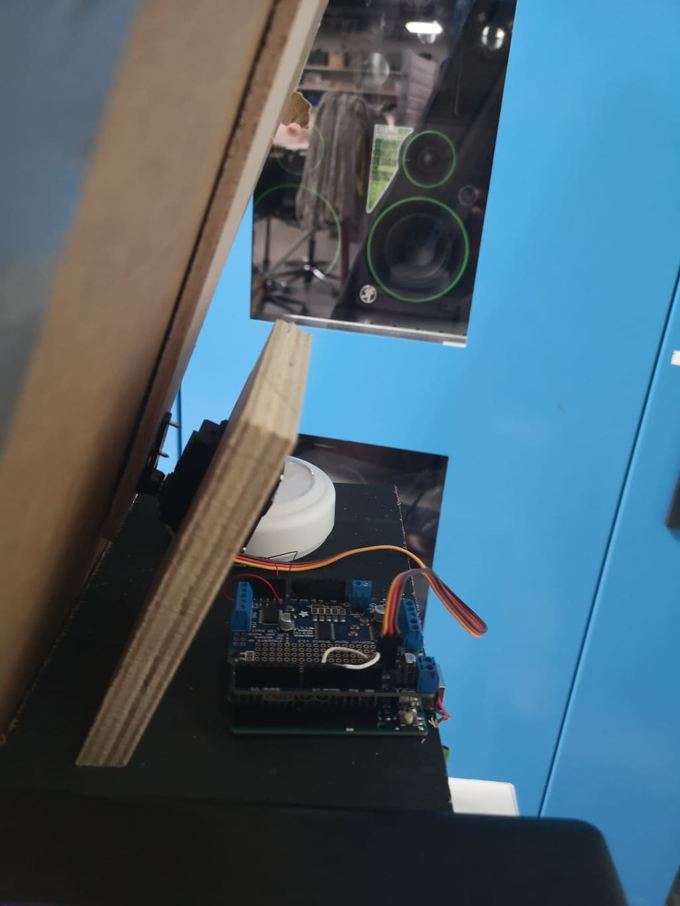
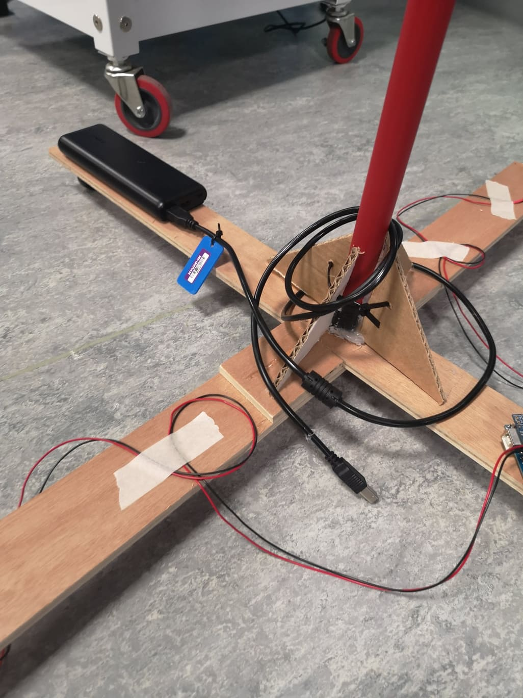
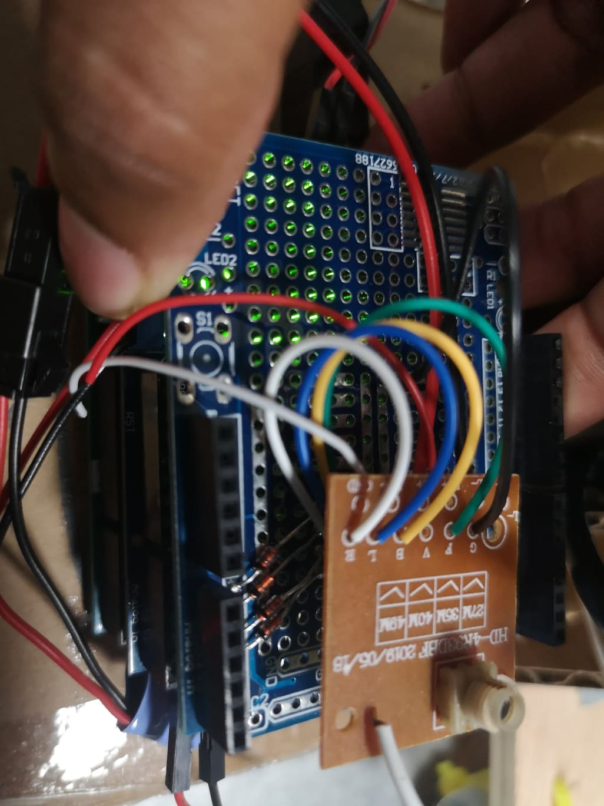

# Final Documentation

## Overall project concept and description

**Gremlins!** was a 3 minute piece about household items which come to life. The project was inspired by Fantasia's *The Sorceror's Apprentice* which was brought up by Hatim in class. 
 
I decided to make 5 items:

* a broom

* a mop

* a duster

* a bucket

* a self cleaning mirror

In the performance, the items start moving one after the other but freeze whenever the owner looks up from her paper. Finally she falls asleep at which point the items all start cleaning together and moving around the room. When the owner wakes up, she is thoroughly startled.
 

The piece is meant to be mechanical slap stick and comedic while still showcasing the versatility of robotics.

## Overall video

The video of the final project can be found [here](https://youtu.be/KPfJLhOb6I0).

## System diagram of the hardware

## List of important parts

* Mop
  - arduino
  - moto shield
  - 2 yellow DC motors
  - 2 castor wheels
  - adafruit bluetooth friend
  - phone
  - mop
  - mobile stand
  
* Broom
  - arduino
  - motor shield
  - proto shield
  - radio signal wire
  - radio remote control
  - 2 yellow DC motors
  - castor wheel
  - broom
  - stand for broom
  
* Bucket
  - arduino
  - moto shield
  - 2 large wheel DC motors
  - 2 castor wheels
  - adafruit bluetooth friend
  - phone
  - bucket
  - mobile base
  
 * Mirror
  - arduino
  - motor shield
  - servo
  - IR sesnor
  - IR remote control
  - magnets
  
 * Duster
  - arduino
  - motor shield
  - DC motor
  - duster
  - IR Sensor
  - IR Remote Control

## Pictures of the electronics

![](wiring5.jpg.jpg
## Major Challenges

There were quite a few challenges in making this project. However I would like to highlight a few and how I overcame them

* **THE MIRROR**

Like I said in my final progress report, this mirror became the bane of my existence. After workingn for most of the time doing this project, the week before the show case, the servo burnt out. Michael suggested that I put a new servo motor and that it should last. However a couple days later, that servo also burnt out. I then switched the power from a 6V charger to a 6V battery pack. The challenge then was that while the servo was not burning out, the magnets were too strong and the servo was only inching back and forth rather than sweeping across the mirror. 
 
I then decided to go back to the charger and the robot worked for a couple trials. However, it too burnt out. Finally I got the servo to work without burning out but the friction was preventing it from moving again. Michael suggested using acrylyc to decrease the friction. However, with the added acrylic, the magnets were too week and would separate and fly off. 
 
In the end, with the help of Michael, we cut a pendulum shaped hole in the mirror and let the cloth move up and down through that hole. I was sad that my mechanism didn't make it to the final piece, but sacrifices need to be made for the greater good of the performance. 

* **MOTOR SHILEDS**

A next major problem was that of motor shields which would not allow motors to work. Ironic right? I went through all the motor shields in the lab. Those which worked had things soldered into them preventing me from adding the bluetooth device. Those that were free for bluetooth, many just didn't work. Finally were realised that the problem was that one of the components of the motor shield were soldered together making the motors run on a different address than the default one. Once this was desoldered, the motors worked again and the problem was solved.
 
While this was a quick fix, it took a ver long time because the part that was soldered together was very small and I didn't not notice or know its significance. However, I know to look for minor differences in a motor shield such as this to make them run.

* **WIRELESS CONTROL**

Having 5 wirelessly controlled robots was difficult to maneuver as I needed to ensure that all of them worked without interfereing with eachother. At first we bought wireless lights and hoped to control the different robots with that remote. However we realised once the shipment arriv ed that the lights all worked with IR sensors and would be all turned on and off given the range of the robots. 
 
However this purchase was not put to waste as I used them to control the two robots which had repetitive movements. Two others were controlled using bluetooth devices and the final was used by taking apart a radio control car and using the remode to conrol the movement of my personal coded broom. I needed assistance controlling all the roboths simultaneously, but with sufficient practice they all worked smoothly despite having varying wireless controls.
