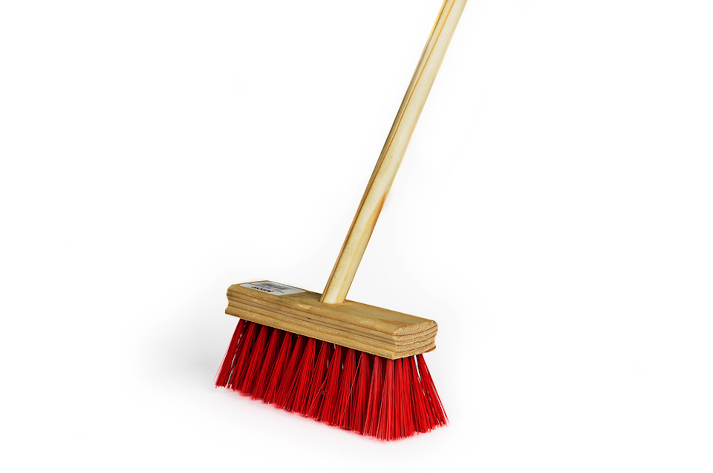

# Progress Report 1

## What I planned to do:

This week I wanted to start prototyping the different houshold items and working on what I think it would look like. Specifically I wanted to collect my motors and various parts of the project. 

## What I did

I believed that the magic mirror and moving broom would be the most difficult aspects of the project. As such I started with the mirror and experimented with the mechanics of the broom.

I used card board as a prototype and and silk cloth to clean. I then wired a server to cardboard to be connected to the back of the 'mirror'. Using magnets I was able to move the cloth 'magically as seen in video:

[Mirror Prototype 1](https://youtu.be/wDm9GexBtdc)

I may redo it with stronger marterial but for now I will be using cardboard and a silk cloth.

Additionally, I reached out to Steven to confirm hours of the prop shop. It is not open until 3pm today but it is open on weekends so I will be going to get houshold items then. 

Even though I hope to use the base of Angelina for the bucket, in the event that it is too bif, I have sourced a wooden base that I could use 

I also used to IM Broom to figure out how the motors would be attached. From my testing the most reasonable approach is to get a broom like the one below, cut the inner bristles and attach the yellow motors with wheels inside the bristiles of the broom. 

The mop would have a similar approach but with curved yellow motors so as to create a little box with the mop head around it.

## Next Steps:

The next steps would be to collect items and prototype the broom and mop. 
