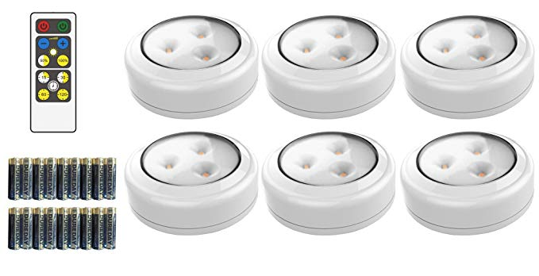

# Progress Report 2

## What I planned to do:

This week I wanted to:

* collect household items 
* prototype broom and mop
* figure out how Bluefruit would work 
* Test cleaning cloth with Servo

## What I did

### Bluefruit (Wireless Control)

First I spoke to Michael about the Bluefruit system. We decided on another method using Brilliant Evolution Wireless lights. 

The lights were ordered on amazon and I am currently waiting their arrival. Once they arrive I will have to remove the LED and connect the Arduinos to use the remote to turn on and off the Arduinos.

### Collect Household Items

I went to the prop shop and loaned out items. I still think I would need a different broom however. The bucket may result in me creating a new base as Angelina's base is signifactly larger than both buckets borrowed. I also borrowed a chair and record player that I am storing for the final presentation. 

### Cleaning Cloth

The next thing I did was to test the servo of the cleaning cloth. The design works well. You can see a video of the final test [here]().

At first one magnet was too week and the servo was causing them to fly off the board. However by adding to magnets, the magnetic strength increased and the mechansim works quite well.

*Improvements*

While the mechanism works well, the design needs improvment. the cardboard attached to the servo is quite flimsy and breaks easily. I will need to use plywood to get the final product stable. Additionally, I will need to create a box of some sort that can hold the motor in place so the the wiper moves and not the motor itself.

### Prototype Mop and Broom

I started off prototypong the broom. However, the broom I am working with is very heavy and much more curved than I would like. As such it is quite difficult to get it to stand without some big stabaliser like in the photo below:

I then researched some videos on how beaple made self moving brooms and came across this video :

[Self Moving Broom]()

I don't think this mechanism will work for me however because the stick will probable be too heavy and weigh it down. I am now back to square one with the broom.

**However** I did make significant progress with the mop. I created a little two wheeled vehicle using to motors with wheels and wood and programmed it to move back and forward by modifying example code. 

[Video showing two wheeled vehichle]()

I then attached the vehichle under the mop and allowed it to move. Interestingly, the strips of the mop occasionally caught in the wheels causing it to move with a certain level of randomness. 

[Mop with Randomness]()

While I like this effect, it is risky considering it could stop moving completely. I plan to make a little mesh to keep the mop strings from tangling and then codeing the mop to move randomly.

I then attached a string to the top of the mop to fully simulate the movement I am going for. At the moment I want to mop to be able to move up and down in the bucket as well. I may change this depending on how it lookes but if not, the mop will move within the confines of the string such as in this final video

[Mop moving from Strinf]()

## Next Steps:

Once the Brilliant Evolution Lights arrive, work on firguring out wireless connection
 
Prototype Duster 
  
Consult Michael for a solution for the broom (May have to make a broom that suits my needs in scene shop)

