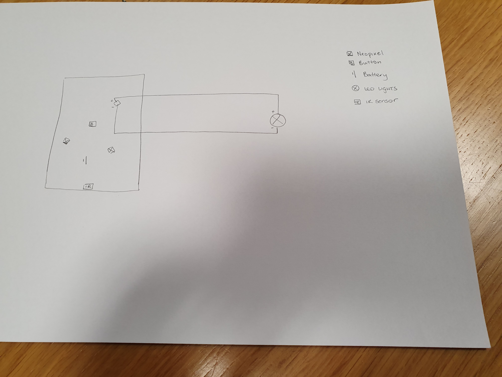
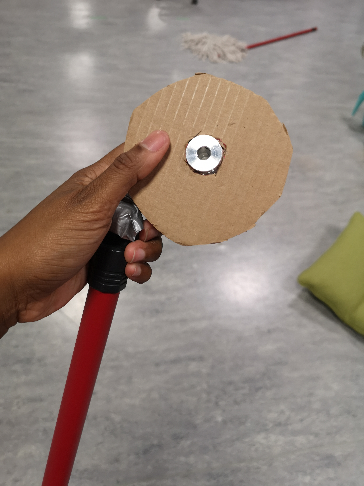
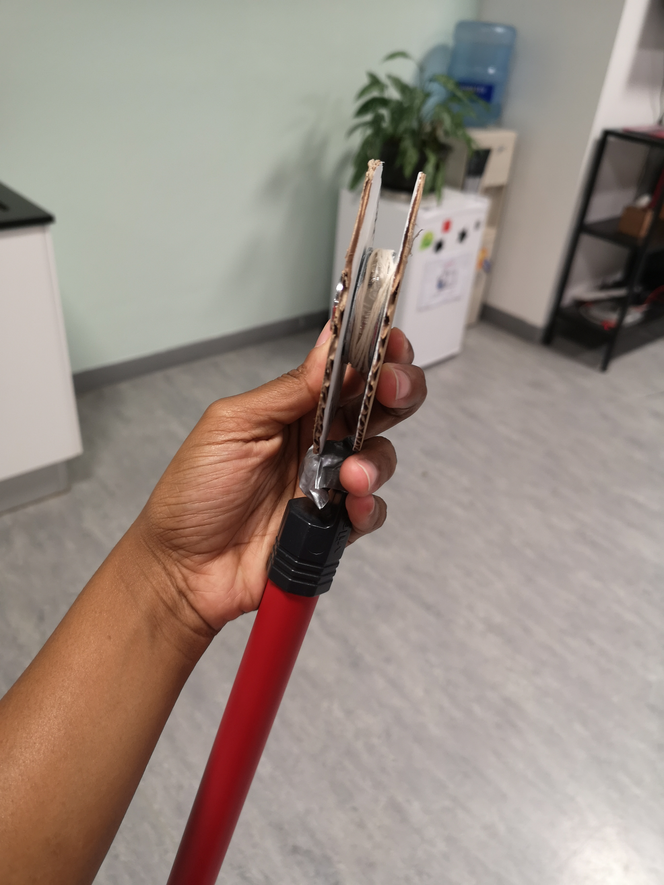
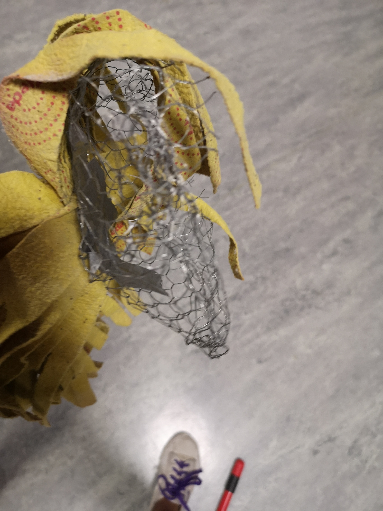
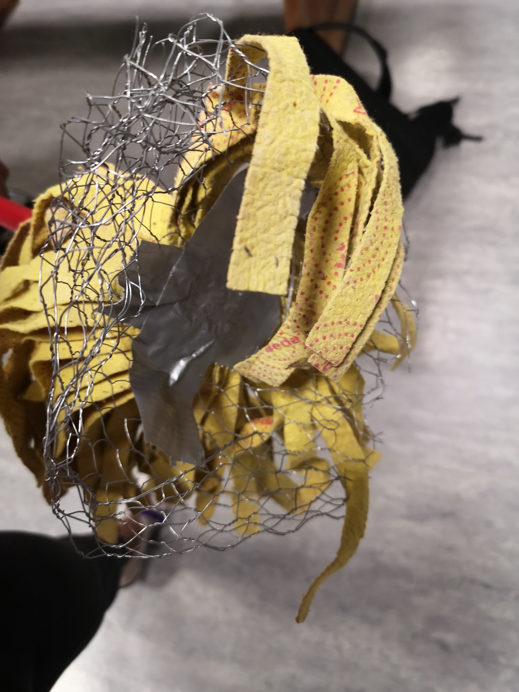
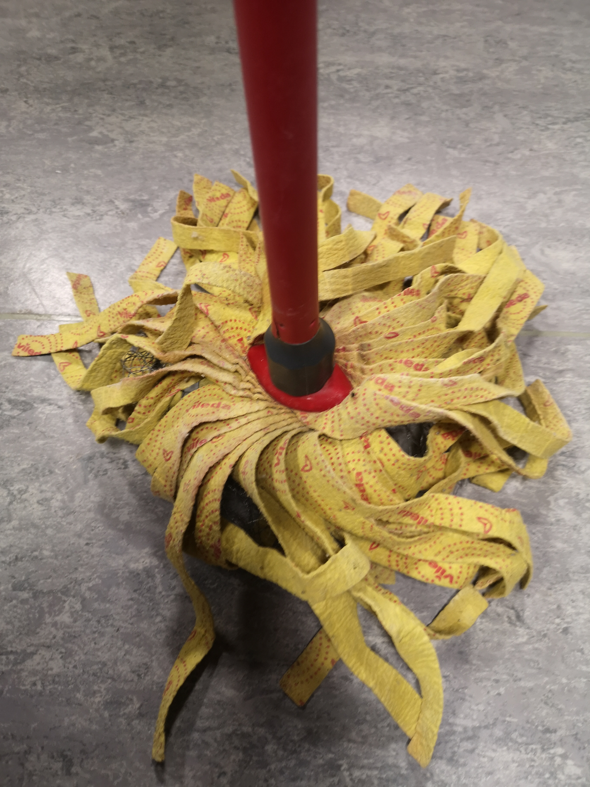
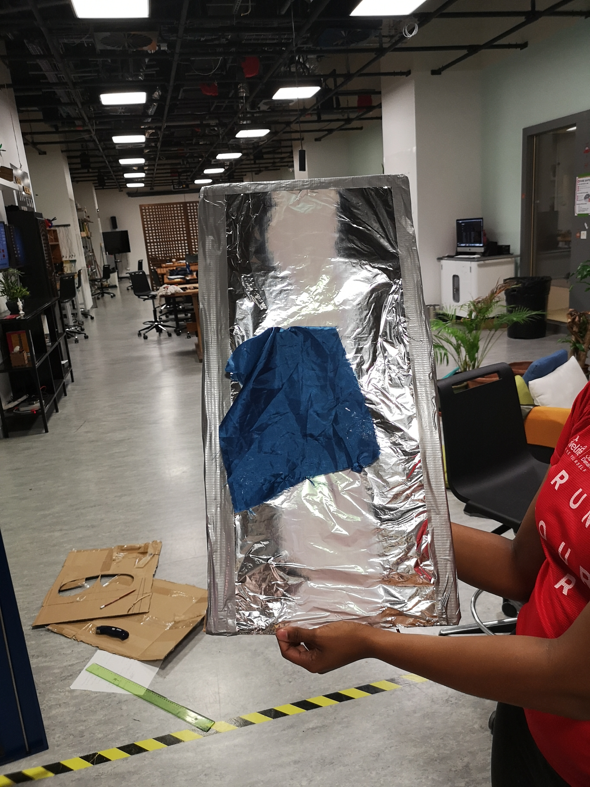
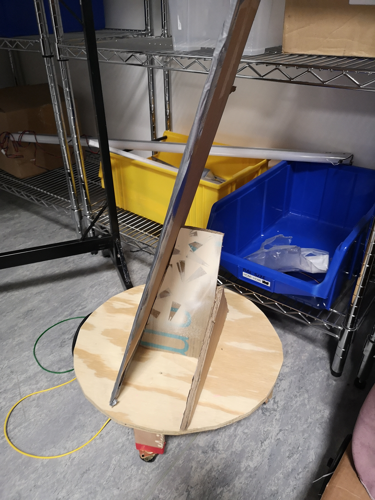
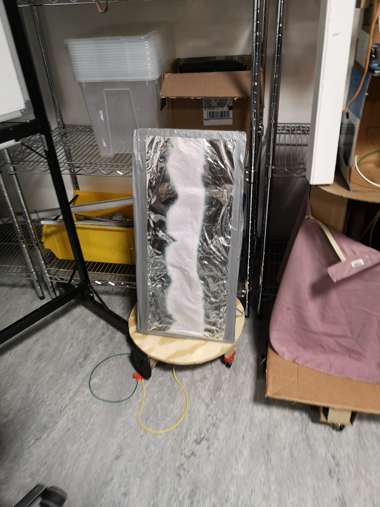

# Progress Report 3

## What I Planned to do:

* Figure out wireless connection with Bright Evolution Lights
* Prototype Duster
* Consult Michael for broom

## What I did:

### Wireless Control

Once the lights arrived, I dismanteled it and figured out the wiring.

I realised that there was a small circuit board with an IR sensor, a battery, a button and 3 neopixels. As such, I scraped off one of the neopixels and soldered on wire to see if I could fuel the current from that light port to an alternative source.
 
My idea worked and I was able to light an LED using the wireless remote. However, when trying to remount the curvuit board, I accidentally put it the wrong way and it short cuircuited. The wires from the board connected with teh wire from the spring and started smoking. I was not able to get a photo of these but below is schematic of what the board looked like.

In any case, this method will not suit my purposes as I need wireless control for each of the lights. These lights only work spearately if far enough apart such that the IR sensor could only pick up one light at a time. However, my robots will be in close proximity and additionally in their movememnt, if I am too far from the sensor or the robot turns in a direction where the sensor is not facing my direction, I will have no control over the robot.

*Alternative* 

Michael and I decided to try another alternative. We ordered one remote controled toy car which I will tinker with. If I can get this to work better then we will order the others for me to wire up.

### Prototype Duster

The next thing I did was to prototype duster. I used a DC motor with a gear and string to allove for an up and down movement as heen in the video . 

At first the string was slipping off the gear so I extended the edges as shown below to allow for smoth movement without falling off:

 

Once this was done it moved quite smoothly as shown in the 

### Consult Michael on broom

I bought a smaller more controllable broom in Daiso. Since this is my property it also allows me more flexibility is cutting the bristles that that of the prop shop did. 

I realised that if I put a heavy enough weight at the front of the broom (by law of moments), the weight of the handle is balanced out. Additionally, I will need to put some support in the middle under the broom (hence the need to cut bristles) in order to support the weight, which the bristles thermselves are not strong enough to do.

I spoke to Michael about my broom ideas and he was supportive but advised me to go to Jon Bonner for building. As such I will go to the scene shop today.

### Other

#### Collecting Arduinos

Each of these items need to be programmed to a separate arduino. Right now I have been using one arduino and uploading which ever test sample code I need. However, now I have collected more arduinos and will be required to labe and wire them according to their corresponding household item and upload their individual codes to them.

#### Improving Current Protoypes:

##### Mop

As stated in the last progress report, the mop worked well but the strings of the mop kepy tangling in the wheels underneath it. As such I added a little wire barrier to keep the strings from getting close to the arduino. However this sstill needs further improvment to ensure that the wire does not touch the arduino and cause a short circuit.

##### Mirror

Since our task was to have 50% of the construction ready, I thought I should probably get my mirror to stand and work. I wanted to test what materials would look like a mirro but not interfere with the magnets. In the end I settles on foil but this may change. I also used a very strong cardboard for the base but I plan to improve this with wood if I have the time.

Mirror Front: 

Mirror Base:

Full Mirror:

## Next Steps

* Consult Jon Bonner about broom
* Once RC toy car arrives figure out how to operate it 
* Program, wire and label individual arduinos
* Prototype bucket

