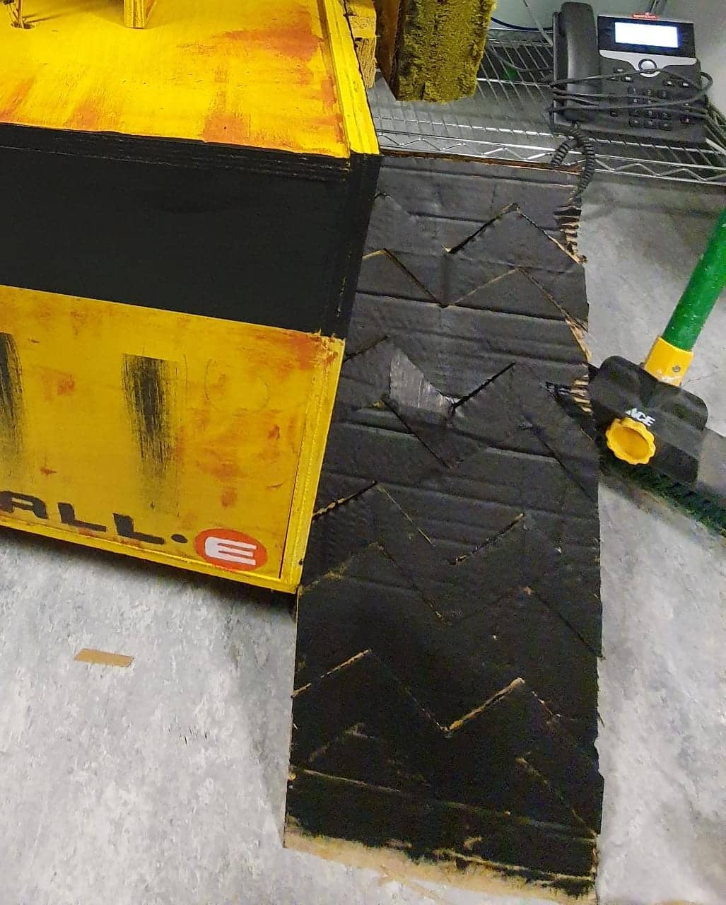
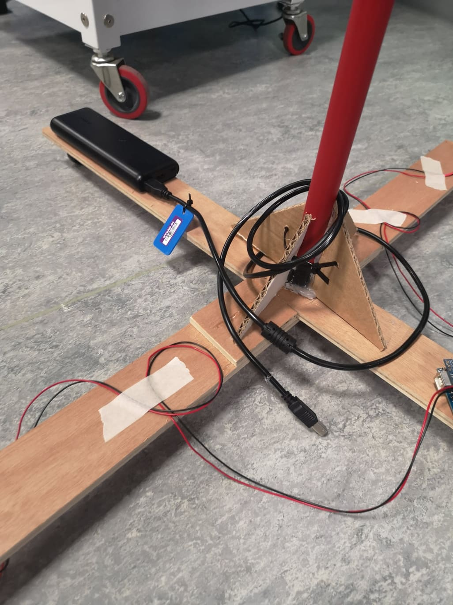
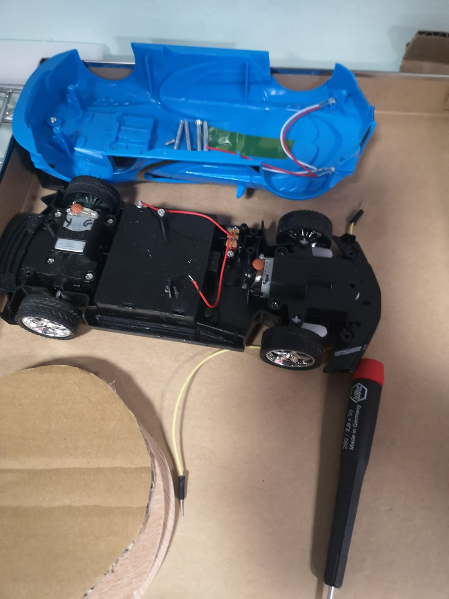
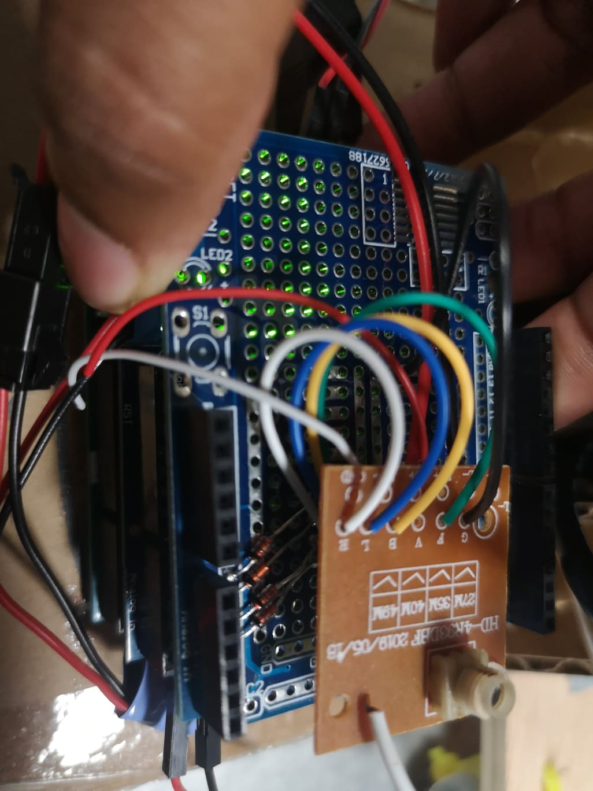
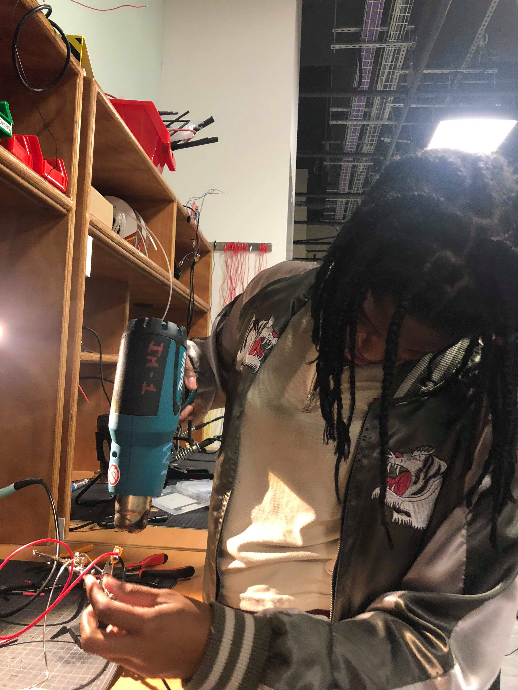

# Progress Report 4

## What I planned to do:

* Consult Jon Bonner about broom
* Once RC toy car arrives figure out how to operate it
* Program, wire and label individual arduinos
* Prototype bucket

## What I did:

### Broom

After consulting Jon about the broom I decided to create different prototypes to see how to make the broom work. My first design did not work very well as the broom still fell. I tries really hard to make the broom work without the mechanics being seen but in the end I had to compromise. 

I was inspired by Ahmed's design which when I playfully leaned the broom on, it stood without falling. 

I decided to make a clean protoype using this design which allowed the broom to stand. 
 
I then created a little vehicle which allowed the broom to move forward. However, it was not strong enough to pull the broom back or turn. As a result I added caster wheels which helped with moving back but still caused a problem when turning. 
 
After consulting Michael I put the wheels below the brom rather than behind the broom. This also improved the design but there was still a balance problem. 
Finally, I made the base wider for the back wheels which allowed for the broom to move without tipping over.

### RC Toy

I owe much to Michael who helped me greatly with this. Once the little toy car arrived (and I played with it briefly), I deconstructed the vehichle to examine its parts. The vehicle had 4 controls which by radio synced with the wheels of the vehicle. The allowed for forward, backward, lelft and right. 

Michael helped me understand the mechanism and learn that even though the controls were synced to specific instructions it basically just worked by sending power to the respective wheels. 

By changing the direction of power using a diode, the remote could be used to trigger certain pins which could then be used as conditions.

### Steps to making the RC Motor Toy Work for my purpoes

1. Remove Parts
2. Solder wires on RC circuit board to a pins in protoshield
3. Solder diodes which allow current to flow only in one direction at a given point
4. Attach RC Circuit board to protoshield
5. Program to allow analog read from each pin
6. Use the input to create conditions for motor
7. Debug

Finally, the method worked and allowed for wireless movement of the broom

### Program Wire and Label individual arduinos

This task was completed and the various arduinos kept track of. The next challenge would be to keep track of yourself. SOme of the motorshields were not working and needed to replace. Lesson Learned - never wait to test and ask questions.

*Prototype Bucket*
The bucket was quite easy to protoype as I used the base from our midterm project. Ideally I would have wanted to make a more subtle base, however hiven time contraint I decided against it. Now I am quite happy at what was made. I did have to redo one of the wheels and resolder the battery but this only took like 30 mins time.

## Other tasks accomplished

*Tested all the items together*

Once I had all the items working to some extent, I tested them together as could be seen in this [video](). 
