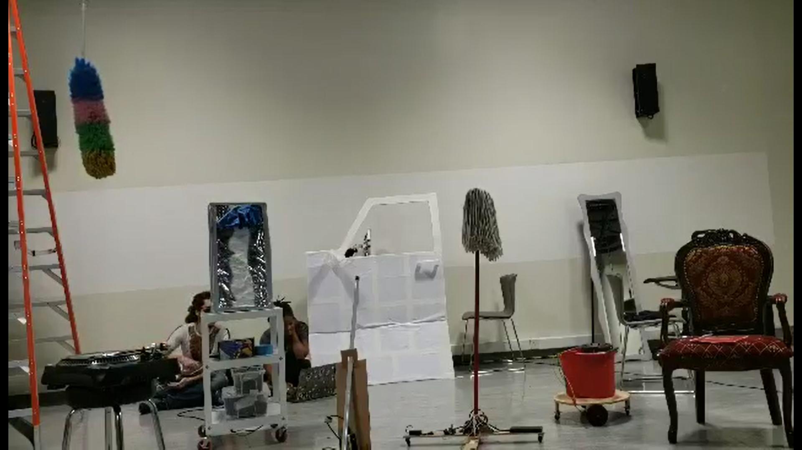

# Progress Report 4

## What I planned to do:

* Test and debug all robots together
* Have mop and bucket work with bluetooth
* Set up in 006
* Test with Natasha and Hatim

## What I did:

### Test and debug all robots

I tested all the robots together in the IM Lab. At this point I didn't have bluetooth working for both devices but I wanted to have a holistic picture of all 5 machines and how they would turn on and off. The broom and the Duster worked quite well and I was able to sign them off as complete. The bucket and the mop worked and just needed to be tested controlled by bluetooth. The mirror... I will come back to that.
 

The main issue I gathered from the test was the need for portable power sources. I had 2 power banks for the arduinos but I needed 3 more. I also needed portable power for the motors. After speaking to Michael, I was bale to geth 6V and 9V batteries packs.

*The Mirror*
 

The mirror, my first working robot in this project decided to start giving trouble just as I started group testing and from then on became the bane of my Performing Robots existence. In this testing, at first the mirror worked fine. Then we started smelling smoke. By this point I knew very well how to detect a burned out servo having burned out two before that due to mis-wiring. After speaking to Michael, I installed a new servo in the mirror and hoped for the best...

### Mop and Bucket with bluetooth

The bluetooth was quite simple to install. Fortunately, of the 6 motor shields which I checked out from the lab, 2 already had been soldered for bluetooth devices. I checked to make sure they had been done correctly and finding that they were, I just had to solder the pins into one of the bluetooh devices.
 
This provided me more time to test and calibrate the mops and broom. Given that the wheels changed when I changed the wiring, I had to make sure the buttons aligned with the directions of the motors (see code).
 
It was very important for me rename the bluetooth devices since I would be using 2 at the same time. Once this was done, I could manipulate the two at the same time.

### Set up in 006

The most difficult part of setting up in 006 was insatalling the duster from the ceiling. It seemed very precarious, however with the use of zip ties I was able to stabalise it. The challenge was that every time I wanted to fix something, I needed to use the ladder. This was particularly challengeing was turning on and off the power sources for the motor and the arduino. However, I let them charge overnight and reinstalled them just before the IM showcase started.

I also spiked all my equipment with red tape to make sure that they would be easily placed in the space during showtime. Once this was done, it was just a matter of practicing driving the robots throughout the space.

### Test with Natasha and Hatim

I had 3 tests in the space. Once with Natasha, once with Hatim and one with the two together which could be found [here](https://youtu.be/RUvNm_sH5tQ). These practices were needed to make sure everything ran smoothly in the show. The most difficult part was trying to do a full run through without one of the robots malfunctioning. I think the only run where all the machines worked was the first time I ran it with Hatim and Natasha before filming and in the actual show. 
 
However this was very beneficial to the process as it made me think on my feet and adapt.

## Next Steps

*Showtime!*
